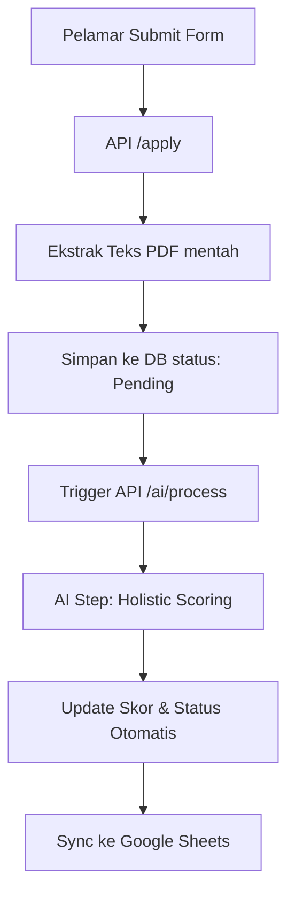

# Pola Arsitektur — AI CV Screening Pipeline (Optimized)

> Dokumen ini menjelaskan alur kerja sistem terbaru yang sudah dioptimalkan: tanpa langkah ekstraksi terpisah dan menggunakan scoring holistik.

---

## 🗺️ Gambaran Besar (Big Picture)

Sistem ini bekerja dengan mengalirkan data CV mentah langsung ke otak AI (Gemini) untuk mendapatkan penilaian instan berdasarkan kriteria posisi.

| Sisi | Teknologi | Fungsi |
|---|---|---|
| **Frontend** | Next.js (React) | Form lamaran & Dashboard HR |
| **Backend API** | Next.js API Routes | Logika bisnis & Orchestrator AI |
| **Database** | Supabase | Penyimpanan data & Konfigurasi |
| **AI Engine** | Google Gemini 1.5 | Penilaian tunggal (Holistic Scoring) |
| **Integrasi** | Drive & Sheets | Backup file & Laporan otomatis |

---

## 🔄 Alur Pipeline: Dari Submit → Hasil AI

### 1. Tahap Penerimaan (`/api/apply`)
- Validasi file dan data.
- Ekstraksi teks mentah dari PDF menggunakan `pdf-parse`.
- Simpan teks mentah ke kolom `extracted_cv` di database.
- Langsung beri respon "Success" ke pelamar.

### 2. Tahap Penilaian AI (`/api/ai/process`)
Langkah ini berjalan di background (asynchronous) untuk memberikan keputusan:

- **Input:** Teks CV mentah (`extracted_cv`) + Kriteria Posisi (`must_have`, `nice_to_have`, dll).
- **Proses:** AI melakukan analisa dalam **satu kali panggilan (1 API Call)**.
- **Output AI:**
  - `score_total` (0-100): Nilai keseluruhan kecocokan.
  - `ai_reason`: Alasan lengkap mengapa diterima/ditolak (Bahasa Indonesia).
  - `meets_all_must_haves`: Cek kepatuhan syarat wajib.

### 3. Penentuan Status Otomatis
Berdasarkan nilai dari AI, sistem menetapkan status:
- **Auto Rejected:** Jika `meets_all_must_haves` adalah false ATAU Skor < Threshold Bawah.
- **Auto Approved:** Jika Skor > Threshold Atas.
- **Manual Review:** Jika Skor berada di rentang tengah.

---

## 💡 Optimalisasi Utama (Token Saving)

1. **Direct Scoring:** Kita menghapus langkah ekstraksi terstruktur (JSON parsing awal) yang sebelumnya memakan 1 panggil AI tambahan. Sekarang, AI langsung menilai dari teks mentah.
2. **Simplified Scoring:** Tidak ada lagi pembobotan manual (Skill 30%, dll). AI menggunakan intuisi rekruter profesional untuk memberikan satu skor final yang mencakup semua aspek.
3. **Consolidated Reason:** Alasan diterima dan ditolak digabung menjadi satu field `ai_reason` agar lebih efisien dan mudah dibaca HR.

---

## 🔑 Fitur Ketahanan (Reliability)

- **API Key Rotation:** Menggunakan 5 API Key bergantian jika terjadi limit kuota.
- **Robust Parsing:** Membersihkan output AI dari karakter sampah/markdown agar data selalu valid masuk ke database.
- **Configuration Hot-reload:** Prompt AI bisa diubah sewaktu-waktu via `/dashboard/settings` tanpa deploy ulang kode.
